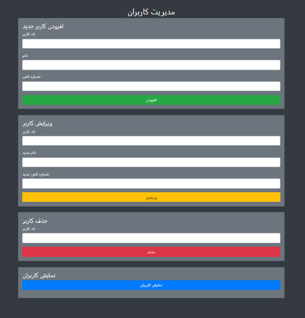

# پنل مدیریت کاربران ساده

[نسخه انگلیسی](README.md)

<p align="center">
  
</p>

یک پنل مدیریت کاربران ساده ولی کاربردی با استفاده از ASP.NET Framework 4.8 و دیتابیس SQL Server.

🎯 نسخه: `v1.0.0`  
📦 نسخه منتشر شده: [مشاهده تگ‌ها](https://github.com/Phix0n-z3r/simple-user-admin-panel/releases)

---

## ✨ امکانات

یک سیستم پایه مدیریت کاربران با قابلیت‌های زیر:

- **➕ افزودن کاربر**:  
  - فیلدها: `کدکاربر (KarbarId)`, `نام (Nam)`, `شماره تلفن (ShomareTelefon)`

- **✏️ ویرایش کاربر**:  
  - ویرایش بر اساس `کدکاربر (KarbarId)`  
  - فیلدها: `نام جدید (New:Nam)`, `شماره تلفن جدید (New:ShomareTelefon)`

- **🗑️ حذف کاربر**:  
  - بر اساس `کدکاربر (KarbarId)`

- **📋 مشاهده کاربران**:  
  - نمایش لیست تمامی کاربران موجود در دیتابیس SQL Server

> 🚫 دیتابیس در این مخزن **قرار داده نشده است**.  
> شما باید دیتابیس خود را بر اساس مدل موجود `User (karbaran)` ایجاد کنید.  
> در صورت نیاز به کمک یا نمونه دیتابیس، از طریق Issues در گیت‌هاب یا @PhixOn-z3r در تلگرام با من تماس بگیرید.

---

## ⚙️ فناوری‌های استفاده شده

| لایه         | فناوری                  |
|--------------|-------------------------|
| بک‌اند       | .NET Framework 4.8      |
| دیتابیس      | SQL Server              |
| رابط کاربری  | Web Forms               |

---

## 🚀 شروع به کار

برای اجرای پروژه به صورت محلی، مخزن را کلون کرده و مراحل زیر را انجام دهید:

```bash
git clone https://github.com/Phix0n-z3r/simple-user-admin-panel.git
cd simple-user-admin-panel

# بازیابی بسته‌های NuGet
dotnet restore

# (اختیاری) اعمال مایگریشن‌های EF
dotnet ef database update

# اجرای برنامه
dotnet run
---

<p align="center" style="color:gray; font-size:small; margin-top: 20px;">
  Noob days
</p>